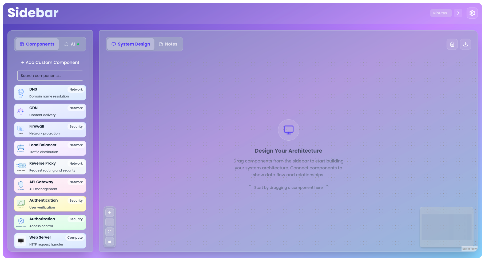
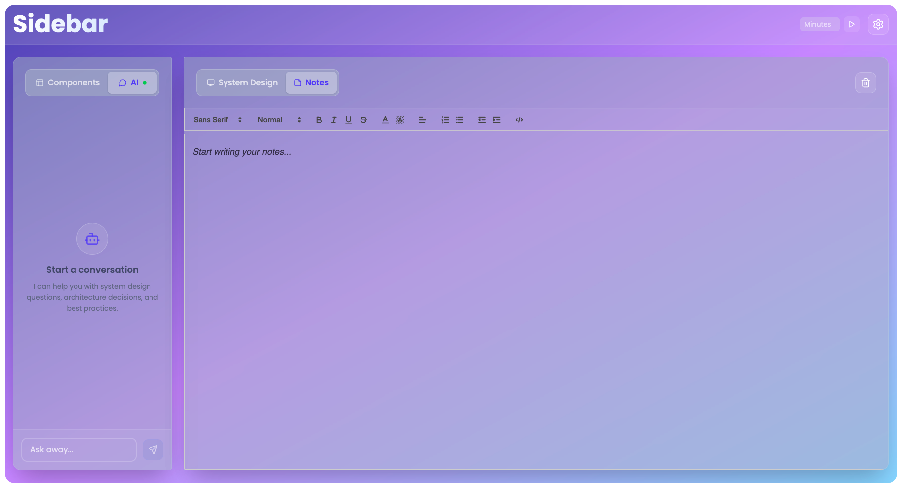
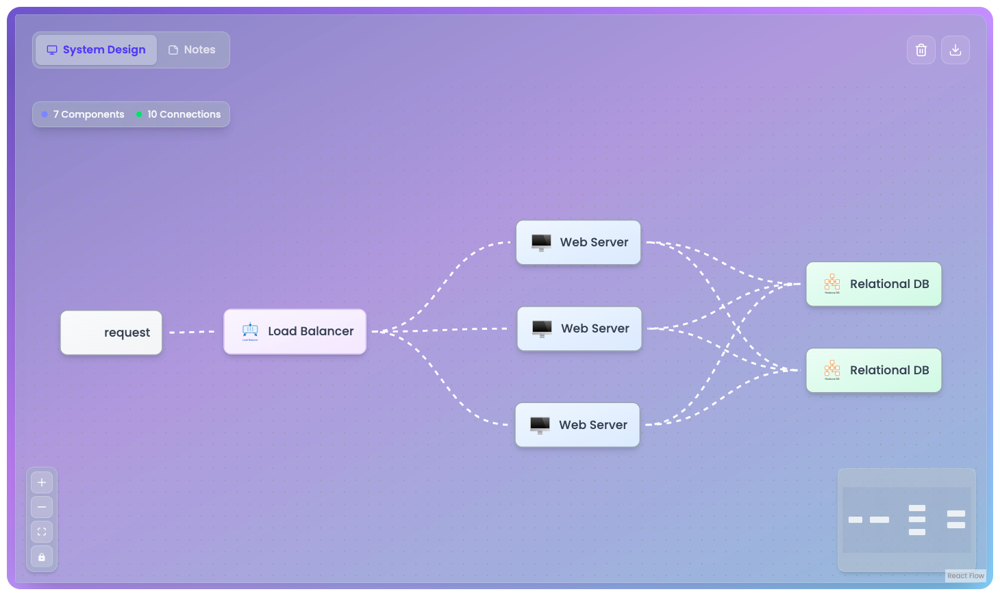

# Sidebar

> An AI-powered educational board game for practicing Architecture/System Design interviews

## 🚀 Overview

Sidebar is an interactive web application that transforms system design interview preparation into an engaging, visual experience. Built to bridge the gap between theoretical knowledge and practical interview skills, it provides a realistic simulation environment where engineers can practice designing scalable systems with AI-powered feedback.

## 📸 Screenshots

### Interactive Component Board

*Drag-and-drop interface with categorized system components (Network, Security, Compute) for building architecture diagrams*

### AI Interview Assistant
 
*Intelligent chat interface that conducts realistic system design interviews with contextual questioning*

### Complete Architecture Design

*Example of a completed system design showing load balancer distributing traffic to multiple web servers connected to relational databases*

## ✨ Key Features

### 🎨 Interactive Visual Board
- **Drag-and-drop interface** for creating system architecture diagrams
- **30+ system components** including Web Servers, Databases, Load Balancers, Message Queues, CDNs, and more
- **Real-time connections** between components to visualize data flow and relationships
- **Categorized components** (Compute, Storage, Network, Messaging, Security) for easy organization

### 🤖 AI Interview Simulator
- **Realistic mock interviews** that follow industry standard system design interview patterns
- **Context aware questioning** based on the components and connections placed on the board
- **Progressive interview phases**: Requirements Clarification → High Level Design → Deep Dive → Scale & Reliability
- **Constructive feedback** and performance evaluation with actionable insights

### 💾 Robust Data Management
- **User authentication** and project management
- **Persistent storage** of board designs and chat history
- **Project sharing** capabilities for collaboration and review
- **Real-time synchronization** of board state with AI conversation context

### 🎯 Educational Focus
- **Structured interview flow** following best practices from top tier tech companies
- **Multiple difficulty levels** from new grad to senior engineer scenarios
- **Comprehensive component library** covering modern distributed systems patterns
- **Performance tracking** and improvement suggestions

## 🛠️ Technical Architecture

### Frontend
- **React** with TypeScript for type safe component development
- **Interactive board** using modern drag-and-drop React Flow library
- **Real-time chat interface** with markdown support
- **Responsive design** for desktop and mobile usage

### Backend
- **Node.js** server with RESTful API design
- **PostgreSQL** database with optimized schema for scalability
- **UUID-based** primary keys for distributed system compatibility
- **JSONB storage** for flexible component properties

### Database Schema
```sql
-- Core entities
Users → Projects → Components/Connections
     → Chat Sessions → Messages
     → Scratch Notes
```

### AI Integration
- **Contextual prompting** system that understands board state
- **Interview phase management** with appropriate questioning strategies
- **Performance evaluation** algorithms for constructive feedback

## 🎮 How It Works

1. **Start Interview**: Choose from various system design problems (URL Shortener, Chat App, Video Streaming, etc.)
2. **Requirements Phase**: AI interviewer asks clarifying questions about scale, features, and constraints
3. **Design Phase**: Build your architecture by dragging components onto the visual board
4. **Deep Dive**: AI probes deeper into specific components and design decisions
5. **Scale Discussion**: Explore how your design handles growth and reliability challenges
6. **Feedback**: Receive detailed performance analysis and improvement suggestions

## 🏗️ Available System Components

**Compute**: Web Server, Microservice, API Gateway, Service Discovery, Circuit Breaker, Health Check

**Storage**: Database, Cache, Relational DB, Object Storage, In-Memory Cache, Data Warehouse

**Network**: Load Balancer, CDN, Reverse Proxy, DNS, Firewall

**Messaging**: Message Queue, Message Broker, Pub/Sub Event Bus, Stream Processing

**Security**: Authentication Service, Authorization, Rate Limiter, WAF, VPN

**Monitoring**: Monitoring, Logging, Metrics, Analytics, APM, Real-time Dashboard

## 🎯 Target Audience

- **Software Engineers** preparing for system design interviews
- **Computer Science Students** learning distributed systems concepts
- **Engineering Teams** conducting internal training and knowledge sharing
- **Interview Coaches** looking for interactive teaching tools

## 🚦 Getting Started

```bash
# Clone the repository
git clone https://github.com/yourusername/sidebar.git

# Install dependencies
cd sidebar
npm install

# Set up database
psql -d your_database -f server/db/schema.sql

# Start development server
npm run dev
```

## 🤝 Contributing

We welcome contributions! Whether it's new system components, interview scenarios, AI improvements, or bug fixes, check out our contributing guidelines to get started.

## 📄 License

MIT License - see LICENSE file for details

## 🌟 Why Sidebar?

Traditional system design preparation often involves static diagrams and theoretical discussions. Sidebar makes it **interactive**, **visual**, and **intelligent** - providing the closest experience to a real interview while offering personalized feedback for continuous improvement.

Perfect for engineers at any level looking to master one of the most challenging aspects of technical interviews.

---

*Built for the engineering community*
